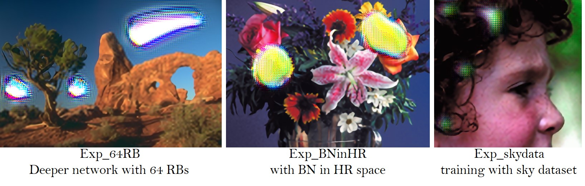

# High-Resolution Generative Adversarial Network 🚀


**High-Resolution Generative Adversarial Network**  
**High-Resolution Generative Adversarial Network** is a state-of-the-art method for restoring photo-realistic details from low-resolution images using deep learning.  
It integrates dense residual blocks, perceptual loss, and GAN innovations for visually convincing outputs.

---

## 🔍 Introduction

**ESRGAN** improves upon SRGAN by:
- Removing Batch Normalization (BN) layers.
- Introducing **Residual-in-Residual Dense Blocks (RRDB)**.
- Using **Relativistic Average GAN (RaGAN)**.
- Applying **Perceptual Loss using pre-activation VGG features**.

These upgrades improve sharpness, texture realism, and perceptual quality of super-resolved images.  

---

## 🛠 Features

- RRDB: Deep residual-dense network without BN.
- RaGAN: More stable GAN training and better detail.
- Network interpolation: Blend between PSNR and perceptual models.
- Works with grayscale, 16-bit, and alpha-channel images.

---

## 🧱 Model Architecture

```
Low-Resolution Input
        ↓
Residual-in-Residual Dense Blocks (RRDB)
        ↓
Upsampling Layers
        ↓
Convolution Layers
        ↓
Super-Resolved Output
```

<p align="center">
  
  
</p>

---

## ⚙️ Setup & Installation

```bash
git clone https://github.com/yourusername/ESRGAN
cd ESRGAN
pip install -r requirements.txt
```

Install these packages if not listed:
```bash
pip install numpy opencv-python torch torchvision
```

---

## ▶️ Quick Start

1. Put low-resolution images in the `./LR/` folder.
2. Download pretrained models from:
   - [Google Drive](https://drive.google.com/drive/u/0/folders/17VYV_SoZZesU6mbxz2dMAIccSSlqLecY)
3. Place models inside `./models/` directory.
4. Run:

```bash
python test.py
```

Results will be saved to `./results/`.

---

## 🔁 Network Interpolation

Blend between perceptual-quality and PSNR-oriented models:

```bash
python net_interp.py 0.6
python test.py models/interp_06.pth
```

<p align="center">
  
</p>

---

## 📊 Performance

| Model       | Set5 (PSNR/SSIM) | Set14 | BSD100 | Urban100 | Manga109 |
|-------------|------------------|--------|--------|----------|-----------|
| SRCNN       | 30.48 / 0.8628   | 27.50 | 26.90 | 24.52    | 27.58     |
| EDSR        | 32.46 / 0.8968   | 28.80 | 27.71 | 26.64    | 31.02     |
| RCAN        | 32.63 / 0.9002   | 28.87 | 27.77 | 26.82    | 31.22     |
| **ESRGAN**  | **32.73 / 0.9011** | **28.99** | **27.85** | **27.03** | **31.66** |

---

## 🎯 Perceptual-Driven Super-Resolution

| Dataset    | ESRGAN | SRGAN | EnhanceNet |
|------------|--------|--------|------------|
| Set5       | ✅     | ✅     | ✅         |
| Set14      | ✅     | ✅     | ✅         |
| BSD100     | ✅     | ✅     | ✅         |
| Urban100   | ✅     | ❌     | ✅         |
| PIRM-SR    | ✅     | ❌     | ✅         |
| OST300     | ✅     | ❌     | ✅         |
| DIV2K      | ✅     | ❌     | ✅         |

---

## 🔬 Ablation Study

We evaluated:
- **With vs Without BN**
- **Standard vs Relativistic Discriminator**
- **Perceptual loss before vs after activation**

<p align="center">
  
</p>

---

## 🧪 BN Artifacts

Removing BN layers avoids visual glitches in deep networks.

<p align="center">
  
</p>

---

## 🧠 Training Tips

- Use **smaller weight initialization** (×0.1 of MSRA).
- Apply **residual scaling** inside deep residual networks.
- Train in two stages:
  1. L1-based PSNR model
  2. Fine-tune with adversarial and perceptual loss.

---

## 📥 Citation

```bibtex
@InProceedings{wang2018esrgan,
  author    = {Wang, Xintao and Yu, Ke and Wu, Shixiang and Gu, Jinjin and Liu, Yihao and Dong, Chao and Qiao, Yu and Loy, Chen Change},
  title     = {ESRGAN: Enhanced super-resolution generative adversarial networks},
  booktitle = {ECCV Workshops},
  year      = {2018}
}
```

---

